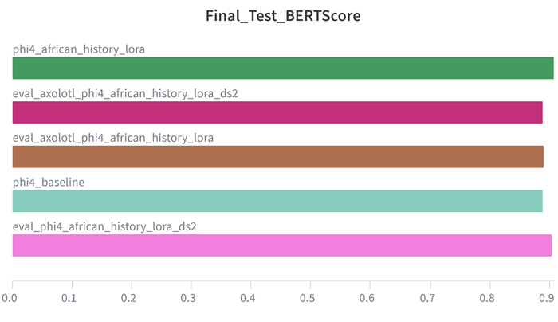
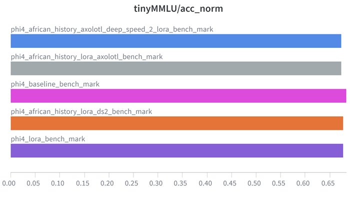
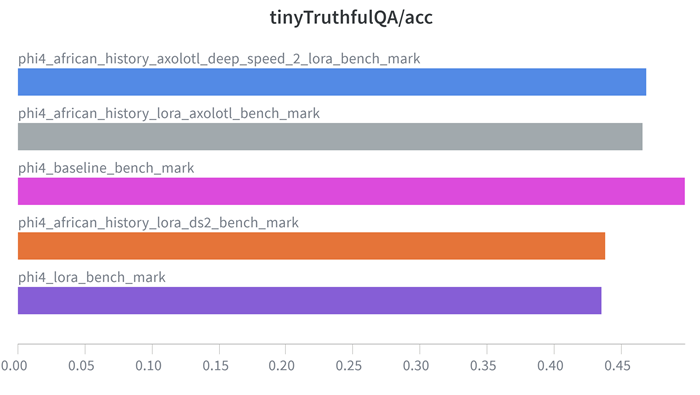

# **LoRAfrica: Scaling LLM Fine Tuning for African History**

## **Aim**
Fine tune [Phi-4-mini-instruct](https://huggingface.co/microsoft/Phi-4-mini-instruct) model using LoRA on the consolidated [African History Dataset](DannyAI/African-History-QA-Dataset)

## **Objectives**
- Fine tune model using LoRA
- Fine tune model using LoRA with Deep Speed stage-2
- Fine tune model using LoRA with Axolotl
- Fine tune model using LoRA with Deep Speed stage-2 via Axolotl
- Compare metrics of baseline model with fine-tuned models

## **How the Project Goes**
- Create your accounts on [Weights and Biases](https://wandb.ai/site), [Huggingface](https://huggingface.co/) and [Runpod](https://console.runpod.io/).
- Create your access tokens on Weights and Biases & Huggingface (you will need read and write token previlages on Huggingface)
- An A40 pod instance created on [Runpod](https://console.runpod.io/). Refer to this [video](https://youtu.be/Wofw-l7Cnis?si=_2z2oO0g90P7hO9p) to learn on to create a Pod instance
- Once instance is created, clone project into runpod workspace environment using `git clone https://github.com/daniau23/LoRAfrica.git` or just drag and drop each file/folder
Once all files and folders are in the environment, the requirements file must be installed by running `pip install -r requirements.txt`

### **Data**
- Using Google Colab, the dataset was created and pushed to Huggingface; check `data` folder for the notebook.

### **Baseline**
- Using Google Colab, the baseline bert score and benchmark (tinyMMLU & tinyTruthfulQA) were recorded and pushed to Weights & Biases; check `baseline` folder

### **Fine tuning and benchmarking without Axolotl**
Once `requirements.txt` is installed, navigate to the project `lora` folder.
- `lora_fine_tuning.ipynb` is the fine tuning file for lora
- `lora_benchmark.ipynb` is the lora benchmark file 
- `deep_speed_2_lora.py` is the lora fine tuning file using deep speed with the config `ds_config_2.json`. To run this file use `accelerate launch deep_speed_2_lora.py`
- `eval_deep_speed_2_lora.py` is the deep speed lora evaluation file. To run this file use `python eval_deep_speed_2_lora.py`
- `deep_speed2_lora_benchmark.ipynb` is the deep speed lora benchmark file 

### **Fine tuning and benchmarking with Axolotl**
First of all, many thanks to the entire team at **[READY TENSOR](https://app.readytensor.ai/)** as they showed me how to fine tune models via yaml files. This aspect of the project may not be perfect but has set the foundation for further research of using axolotl for finetuning models with just yaml files.

To fine tune with Axolotl, you will need to create a new Pod instance with the [axolotl environment](https://console.runpod.io/hub/template/axolotl-runpod?id=v2ickqhz9s) already installed. Refer to this [video](https://youtu.be/HL0K9IkSd0U?si=vEK5RV7HKDHWPXnn) on how to create the pod instance

In the `axolotl` folder;
- The `lora.yml` is the file needed to run lora fine-tuning without deep_speed. Run this file using `axolotl train axolotl/lora.yml`
- The `eval_axolotl_lora.py` is the evaluation file for running for lora with axolotl. Run using `python eval_axolotl_lora.py`
- The `axolotl_lora_benchmark.ipynb` is the lora benchmark file 
- The `deep_speed_lora.yml` is the file needed to run lora fine-tuning with deep_speed with the config file `ds_config_2.json`. Run this file using  `axolotl train axolotl/deep_speed_lora.yml`
- The `eval_axolotl_deep_speed_2_lora.py` is the evaluation file for running for lora with axolotl. Run using `python eval_axolotl_deep_speed_2_lora.py`
- The `axolotl_deep_speed_2_lora_benchmark.ipynb` is the lora with deep speed benchmark file 

In the `compare_model_answers` folder, the fine-tuned model answers are compared to the base model and reference answers

### **Results**
Below are the results from this project on the test set data; Kindly refere to the `img/results_wandb` folder for the results

|Model| Bert Score|
|--|--|
|phi4_baseline|0.88868
|phi4_african_history_lora|0.90726
|eval_phi4_african_history_lora_ds2|0.90339
|eval_axolotl_phi4_african_history_lora|0.88981
|eval_axolotl_phi4_african_history_lora_ds2|0.88872

|Model|Tiny MMLU|
|--|--|
|phi4_baseline_bench_mark|0.6837
|phi4_lora_bench_mark|0.67751
|phi4_african_history_lora_ds2_bench_mark|0.67788
|phi4_african_history_lora_axolotl_bench_mark|0.67371
|phi4_african_history_axolotl_deep_speed_2_lora_bench_mark|0.67371

|Model|Tiny TruthfulQA|
|--|--|
|phi4_baseline_bench_mark|0.49745
|phi4_lora_bench_mark|0.43555
|phi4_african_history_lora_ds2_bench_mark|0.43822
|phi4_african_history_lora_axolotl_bench_mark|0.46626
|phi4_african_history_axolotl_deep_speed_2_lora_bench_mark|0.46877

**Weights and Biases**

This is the link to the weights and biases [project](https://wandb.ai/dannyai-danny-the-analyst/phi4_african_history) which has all the logs for this project.
### **Model Links**
- [Phi-4-mini-instruct](https://huggingface.co/microsoft/Phi-4-mini-instruct)
- [phi4_african_history_lora](https://huggingface.co/DannyAI/phi4_african_history_lora)
- [phi4_african_history_lora_ds2](https://huggingface.co/DannyAI/phi4_african_history_lora_ds2)
- [phi4_lora_axolotl](https://huggingface.co/DannyAI/phi4_lora_axolotl)
- [phi4_african_history_lora_ds2_axolotl](https://huggingface.co/DannyAI/phi4_african_history_lora_ds2_axolotl)

## **Issues faced:**
- Trying to set up fine-tune models using yaml files via axolotl
- Trying to accurately mask inputs for assistant only training efficiently
- Cost management of using Runpod while training models

## **Conclusion**
- The fine-tuned models have a better BERT score than the baseline model
- The fine-tuned models have a small drop in performance in TinyMMLU and TinyTruthfulQA benchmarks results when compared to the baseline model